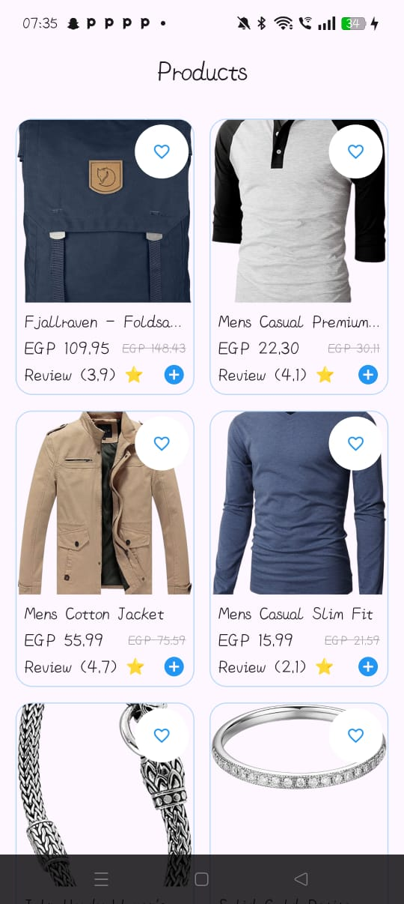
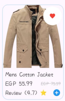
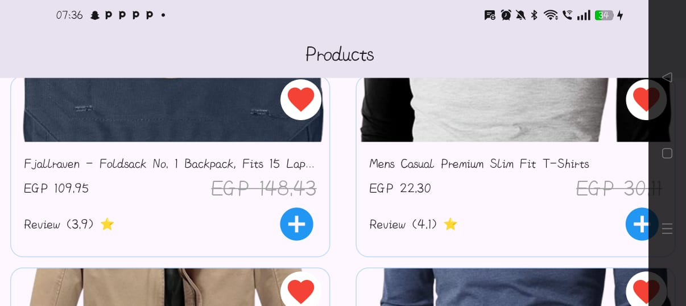

# 🛒 Elevate E-commerce Task

A modern, responsive Flutter E-commerce application built with **Clean Architecture** and **BLoC (Cubit)** pattern.

## ✨ Features
- **Responsive UI:** Using `flutter_screenutil` to ensure a consistent experience across all device sizes.
- **State Management:** Powered by **Cubit** for efficient and scalable state handling.
- **Product Listing:** Fetches and displays products from a remote API.
- **Interactive Favorites:** Real-time "Add to Wishlist" functionality using advanced State Management (copyWith pattern).
- **Modern UI Components:** Custom Product Cards with rating stars, price formatting, and polished aesthetics.

## 🛠️ Built With
Flutter - High-performance UI Framework.
Flutter BLoC (Cubit) - State management for a predictable and reactive UI.
Dio - A powerful HTTP client for Dart, used for API communication and handling network requests.
GetIt - Service Locator for Dependency Injection (DI) to manage object lifecycle.
Flutter ScreenUtil - To achieve a fully Responsive UI across different screen sizes and orientations.
Clean Architecture (MVVM) - Organized project structure into Core, Models, Repositories, ViewModels, and Views for maximum maintainability.

## 📸 Preview
| Portrait Mode | Product Details | Landscape Mode |
| :---: |:---------------:| :---: |
|  |        |  |
## 🚀 Key Implementation Highlights

- **Clean Architecture & MVVM:** Organized the project into clear layers (Core, Models, Repositories, ViewModels, Views) for maximum maintainability.
- **Dependency Injection (DI):** Implemented a Service Locator using `GetIt` (in `core/di`) to manage object creation and singleton instances.
- **Robust Networking Layer:** - Dedicated `api` folder for endpoint management and DIO/HTTP configuration.
    - Centralized **Error Handling** to manage API failures gracefully.
- **Centralized Routing:** Used a dedicated `AppRouter` (in `core/Router`) for clean and organized navigation logic.
- **Repository Pattern:** Abstracted data fetching logic into repositories to decouple the UI from the data source.
- **Advanced State Management:** - Used **Cubit** for reactive UI updates.
    - Implemented the `copyWith` pattern in States to ensure data immutability and integrity.
- **Responsive Design:** Leveraged `flutter_screenutil` to ensure the layout remains consistent across different screen sizes and orientations (Portrait & Landscape).

## 📁 Project Structure
```text

lib/
├── core/             # API configuration, DI (GetIt), Errors, and Routing
├── models/           # Data models (Product, Rating) and JSON serialization
├── repositories/     # Abstract & Concrete repositories for data fetching
├── view_models/      # State Management using BLoC/Cubit (Logic Layer)
└── views/            # UI Layer (Screens & Shared Widgets)
    ├── screens/      # Main application pages
    └── widgets/      # Reusable UI components (ProductCard)